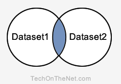

# Oracle / PLSQL : INTERSECT 연산자

이 Oracle 튜토리얼에서는 구문과 예제를 통해 Oracle **INTERSECT 연산자**를 사용하는 방법을 설명합니다.

## 설명
Oracle INTERSECT 연산자는 2개 이상의 [SELECT 문](SELECT.md)의 결과를 반환하는 데 사용됩니다. 그러나 모든 쿼리 또는 데이터셋에서 선택한 행만 반환합니다. 레코드가 한 쿼리에는 존재하지만 다른 쿼리에는 존재하지 않는 경우 해당 레코드는 INTERSECT 결과에서 생략됩니다.

### 교집합(Intersect Query)



**설명** : INTERSECT 쿼리는 파란색 음영 영역에 있는 레코드를 반환합니다. 이 레코드는 Dataset1과 Dataset2 모두에 존재하는 레코드입니다.

INTERSECT 내의 각 SELECT 문은 결과 집합에 유사한 데이터 유형을 가진 동일한 수의 필드가 있어야 합니다.

## 구문
Oracle/PLSQL에서 INTERSECT 연산자의 구문은 다음과 같습니다.
```sql
SELECT expression1, expression2, ... expression_n
FROM tables
[WHERE conditions]
INTERSECT
SELECT expression1, expression2, ... expression_n
FROM tables
[WHERE conditions];
```
### 매개변수 및 인수
#### **expression1, expression2, expression_n**
- 검색하려는 열 또는 계산입니다.
#### **tables**
- 레코드를 검색하려는 테이블입니다. FROM 절에 테이블이 하나 이상 나열되어야 합니다.
#### **WHERE conditions(WHERE 조건)**
- 선택 사항입니다. 레코드를 선택하려면 반드시 충족해야 하는 조건입니다.

## 참고
- 두 SELECT 문에는 동일한 수의 표현식이 있어야 하며 데이터 유형이 유사해야 합니다.

---
## 예제 - 단일 표현식 사용
다음은 동일한 데이터 유형을 가진 하나의 필드를 반환하는 Oracle INTERSECT 예제입니다.
```sql
SELECT supplier_id
FROM suppliers
INTERSECT
SELECT supplier_id
FROM orders;
```
이 INTERSECT 예제에서 suppliers 및 orders 테이블에 모두 supplier_id가 나타나면 결과 집합에 나타납니다.

이제 INTERSECT 쿼리에 [WHERE 조건](WHERE.md)을 추가하여 예제를 더 복잡하게 만들어 보겠습니다.
```sql
SELECT supplier_id
FROM suppliers
WHERE supplier_id <= 99
INTERSECT
SELECT supplier_id
FROM orders
WHERE quantity > 25;
```
이 예제에서는 각 데이터셋에 WHERE 절을 추가했습니다. 첫 번째 데이터셋은 suppliers 테이블의 레코드 중 supplier_id가 99보다 작거나 같은 레코드만 반환되도록 필터링되었습니다. 두 번째 데이터셋은 수량이 25보다 큰 경우 orders 테이블의 레코드만 반환되도록 필터링되었습니다.

---
## 예제 - 여러 표현식 사용
다음으로 Oracle에서 INTERSECT 연산자를 사용하여 둘 이상의 열을 반환하는 방법의 예를 살펴보겠습니다.
```sql
SELECT contact_id, last_name, first_name
FROM contacts
WHERE first_name <> 'John'
INTERSECT
SELECT customer_id, last_name, first_name
FROM customers
WHERE customer_id >= 89;
```
이 INTERSECT 예제에서 쿼리는 contacts 테이블의 contact_id, last_name 및 first_name 값이 customers 테이블의 customer_id, last_name 및 first_name 값과 일치하는 contacts 테이블의 레코드를 반환합니다.

각 데이터셋에 WHERE 조건을 사용하여 결과를 추가로 필터링하여 contacts의 레코드 중 first_name이 John이 아닌 레코드만 반환되도록 합니다. customers 테이블의 레코드는 customer_id가 89보다 크거나 같은 경우 반환됩니다.

---
## 예제 - ORDER BY 사용
다음은 ORDER BY 절을 사용하는 INTERSECT 예제입니다.
```sql
SELECT supplier_id, supplier_name
FROM suppliers
WHERE supplier_id > 500
INTERSECT
SELECT company_id, company_name
FROM companies
WHERE company_name in ( 'Apple', 'Microsoft', 'Oracle' )
ORDER BY 2;
```
두 SELECT 문 간에 열 이름이 다르므로 결과 집합에서 열의 위치에 따라 ORDER BY 절에서 열을 참조하는 것이 더 유리합니다. 이 예제에서는 `ORDER BY 2`로 표시된 대로 supplier_name / company_name별로 결과를 오름차순으로 정렬했습니다.

supplier_name / company_name 필드는 결과 집합에서 2번 위치에 있습니다.

---
**[< 이전](UNION_ALL.md) / [다음 : MINUS >](MINUS.md)**