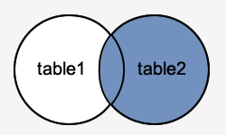

# Oracle  / PLSQL : 조인

이 Oracle 튜토리얼에서는 구문, 일러스트 및 예제를 통해 Oracle에서 JOINS(내부 및 외부)를 사용하는 방법을 설명합니다.

## 설명
Oracle JOIN은 여러 테이블에서 데이터를 검색하는 데 사용됩니다. 두 개 이상의 테이블이 SQL 문에서 조인될 때마다 Oracle JOIN이 수행됩니다.

Oracle 조인에는 4가지 유형이 있습니다.

- Oracle INNER JOIN(단순 조인이라고도 함)
- Oracle LEFT OUTER JOIN(LEFT JOIN이라고도 함)
- Oracle RIGHT OUTER JOIN(RIGHT JOIN이라고도 함)
- Oracle FULL OUTER JOIN(FULL JOIN이라고도 함)

이제 Oracle 조인 구문에 대해 논의하고, Oracle 조인의 시각적 일러스트를 살펴보고, Oracle 조인 예제를 살펴보겠습니다.

---
## INNER JOIN (단순 조인)
이미 Oracle INNER JOIN을 사용하는 문을 작성했을 가능성이 높습니다. 가장 일반적인 조인 유형입니다. Oracle INNER JOIN은 조인 조건이 충족되는 여러 테이블의 모든 행을 반환합니다.

### 구문
Oracle/PLSQL에서 INNER JOIN의 구문은 다음과 같습니다.
```SQL
SELECT columns
FROM table1 
INNER JOIN table2
ON table1.column = table2.column;
```
### 일러스트
이 다이어그램에서 Oracle INNER JOIN은 음영 처리된 영역을 반환합니다.


Oracle INNER JOIN은 table1과 table2가 교차하는 레코드를 반환합니다.

### 예제
다음은 Oracle INNER JOIN의 예제입니다.
```SQL
SELECT suppliers.supplier_id, suppliers.supplier_name, orders.order_date
FROM suppliers 
INNER JOIN orders
ON suppliers.supplier_id = orders.supplier_id;
```
이 Oracle INNER JOIN 예제는 suppliers 및 orders 테이블 모두에 일치하는 supplier_id 값이 있는 suppliers 및 orders 테이블의 모든 행을 반환합니다.

몇 가지 데이터를 통해 INNER JOIN의 작동 방식을 설명해 보겠습니다.

두 개의 필드(supplier_id, supplier_name)가 있는 suppliers라는 테이블이 있습니다. 이 테이블에는 다음과 같은 데이터가 포함되어 있습니다.

| supplier_id | supplier_name   |
| :---------- | :-------------- |
| 10000       | IBM             |
| 10001       | Hewlett Packard |
| 10002       | Microsoft       |
| 10003       | NVIDIA          |

세 개의 필드(order_id, supplier_id, order_date)가 있는 orders라는 또 다른 테이블이 있습니다. 이 테이블에는 다음과 같은 데이터가 포함되어 있습니다.

| order_id | supplier_id | order_date |
| :------- | :---------- | :--------- |
| 500125   | 10000       | 2003/05/12 |
| 500126   | 10001       | 2003/05/13 |
| 500127   | 10004       | 2003/05/14 |

아래에서 Oracle SELECT 문(INNER JOIN 포함)을 실행하면 다음과 같습니다.
```SQL
SELECT suppliers.supplier_id, suppliers.supplier_name, orders.order_date
FROM suppliers
INNER JOIN orders
ON suppliers.supplier_id = orders.supplier_id;
```
결과 집합은 다음과 같습니다.

| supplier_id | name            | order_date |
| :---------- | :-------------- | :--------- |
| 10000       | IBM             | 2003/05/12 |
| 10001       | Hewlett Packard | 2003/05/13 |

supplier_id의 10002 및 10003이 두 테이블에 모두 존재하지 않으므로 suppliers 테이블의 Microsoft 및 NVIDIA 행은 생략됩니다. supplier_id 10004가 suppliers 테이블에 존재하지 않으므로 orders 테이블의 500127(order_id)에 대한 행은 생략됩니다.

#### 옛 구문
마지막으로, 위의 Oracle INNER JOIN 예제는 이전 암시적 구문을 사용하여 다음과 같이 다시 작성할 수 있다는 점을 언급할 필요가 있습니다. (하지만 여전히 INNER JOIN 키워드 구문을 사용하는 것이 좋습니다)
```SQL
SELECT suppliers.supplier_id, suppliers.supplier_name, orders.order_date
FROM suppliers, orders
WHERE suppliers.supplier_id = orders.supplier_id;
```

---
## LEFT OUTER JOIN
또 다른 조인 유형은 Oracle LEFT OUTER JOIN이라고 합니다. 이 유형의 조인은 ON 조건에 지정된 왼쪽 테이블의 모든 행과 조인된 필드가 동일한 다른 테이블의 행만 반환합니다. (조인 조건이 충족됨)

### 구문
Oracle LEFT OUTER JOIN의 구문은 다음과 같습니다.
```SQL
SELECT columns
FROM table1
LEFT [OUTER] JOIN table2
ON table1.column = table2.column;
```
일부 데이터베이스에서는 LEFT OUTER JOIN 키워드가 LEFT JOIN으로 대체됩니다.

### 일러스트
이 다이어그램에서 Oracle LEFT OUTER JOIN은 음영 처리된 영역을 반환합니다.


Oracle LEFT OUTER JOIN은 table1의 모든 레코드와 table2의 레코드 중 table1과 교차하는 레코드만 반환합니다.

### 예제
다음은 Oracle LEFT OUTER JOIN의 예제입니다.
```SQL
SELECT suppliers.supplier_id, suppliers.supplier_name, orders.order_date
FROM suppliers
LEFT OUTER JOIN orders
ON suppliers.supplier_id = orders.supplier_id;
```
이 LEFT OUTER JOIN 예제는 suppliers 테이블의 모든 행과 조인된 필드가 동일한 orders 테이블의 행만 반환합니다.

suppliers 테이블의 supplier_id 값이 orders 테이블에 존재하지 않는 경우 orders 테이블의 모든 필드가 결과 집합에서 <null>로 표시됩니다.

LEFT OUTER JOIN의 작동 방식을 설명하기 위해 몇 가지 데이터를 살펴보겠습니다.

두 개의 필드(supplier_id, supplier_name)가 있는 suppliers라는 테이블이 있습니다. 이 테이블에는 다음과 같은 데이터가 포함되어 있습니다.

| supplier_id | supplier_name   |
| :---------- | :-------------- |
| 10000       | IBM             |
| 10001       | Hewlett Packard |
| 10002       | Microsoft       |
| 10003       | NVIDIA          |

세 개의 필드(order_id, supplier_id, order_date)가 있는 orders라는 두 번째 테이블이 있습니다. 여기에는 다음과 같은 데이터가 포함됩니다.

| order_id | supplier_id | order_date |
| :------- | :---------- | :--------- |
| 500125   | 10000       | 2003/05/12 |
| 500126   | 10001       | 2003/05/13 |

아래에서 SELECT 문(LEFT OUTER JOIN 포함)을 실행하면 다음과 같습니다.

```SQL
SELECT suppliers.supplier_id, suppliers.supplier_name, orders.order_date
FROM suppliers
LEFT OUTER JOIN orders
ON suppliers.supplier_id = orders.supplier_id;
```

결과 집합은 다음과 같습니다.

| supplier_id | supplier_name   | order_date |
| :---------- | :-------------- | :--------- |
| 10000       | IBM             | 2003/05/12 |
| 10001       | Hewlett Packard | 2003/05/13 |
| 10002       | Microsoft       | <null>     |
| 10003       | NVIDIA          | <null>     |

LEFT OUTER JOIN이 사용되었기 때문에 Microsoft 및 NVIDIA에 대한 행이 포함됩니다. 그러나 이러한 레코드의 order_date 필드에 <null> 값이 포함되어 있음을 알 수 있습니다.

#### 옛 구문
마지막으로, 위의 LEFT OUTER JOIN 예제는 외부 조인 연산자(+)를 사용하는 이전 암시적 구문을 사용하여 다음과 같이 다시 작성할 수 있다는 점을 언급할 필요가 있습니다. (하지만 여전히 LEFT OUTER JOIN 키워드 구문을 사용하는 것이 좋습니다)
```SQL
SELECT suppliers.supplier_id, suppliers.supplier_name, orders.order_date
FROM suppliers, orders
WHERE suppliers.supplier_id = orders.supplier_id(+);
```

---
## RIGHT OUTER JOIN
또 다른 조인 유형은 Oracle RIGHT OUTER JOIN이라고 합니다. 이 유형의 조인은 ON 조건에 지정된 오른쪽 테이블의 모든 행과 조인된 필드가 동일한 다른 테이블의 행만 반환합니다. (조인 조건이 충족됨)

### 구문
Oracle RIGHT OUTER JOIN의 구문은 다음과 같습니다.
```SQL
SELECT columns
FROM table1
RIGHT [OUTER] JOIN table2
ON table1.column = table2.column;
```
일부 데이터베이스에서는 RIGHT OUTER JOIN 키워드가 오른쪽 조인으로 대체됩니다.

### 일러스트
이 시각적 다이어그램에서 Oracle RIGHT OUTER JOIN은 음영 처리된 영역을 반환합니다:



Oracle RIGHT OUTER JOIN은 table2의 모든 레코드와 table1의 레코드 중 table2와 교차하는 레코드만 반환합니다.

### 예제
다음은 Oracle RIGHT OUTER JOIN의 예제입니다.
```SQL
SELECT orders.order_id, orders.order_date, suppliers.supplier_name
FROM suppliers
RIGHT OUTER JOIN orders
ON suppliers.supplier_id = orders.supplier_id;
```
이 RIGHT OUTER JOIN 예제는 orders 테이블의 모든 행과 조인된 필드가 동일한 suppliers 테이블의 행만 반환합니다.

orders 테이블의 supplier_id 값이 suppliers 테이블에 존재하지 않는 경우 suppliers 테이블의 모든 필드가 결과 집합에서 <null>로 표시됩니다.

RIGHT OUTER JOIN의 작동 방식을 설명하기 위해 몇 가지 데이터를 살펴보겠습니다.

두 개의 필드(supplier_id, supplier_name)가 있는 suppliers라는 테이블이 있습니다. 이 테이블에는 다음과 같은 데이터가 포함되어 있습니다.

| supplier_id | supplier_name |
| :---------- | :------------ |
| 10000       | Apple         |
| 10001       | Google        |

세 개의 필드(order_id, supplier_id, order_date)가 있는 orders라는 두 번째 테이블이 있습니다. 여기에는 다음과 같은 데이터가 포함됩니다.

| order_id | supplier_id | order_date |
| :------- | :---------- | :--------- |
| 500125   | 10000       | 2013/08/12 |
| 500126   | 10001       | 2013/08/13 |
| 500127   | 10002       | 2013/08/14 |

아래에 SELECT 문(RIGHT OUTER JOIN 포함)을 실행하면 다음과 같습니다.
```SQL
SELECT orders.order_id, orders.order_date, suppliers.supplier_name
FROM suppliers
RIGHT OUTER JOIN orders
ON suppliers.supplier_id = orders.supplier_id;
```
결과 집합은 다음과 같습니다.

| order_id | order_date | supplier_name |
| :------- | :--------- | :------------ |
| 500125   | 2013/08/12 | Apple         |
| 500126   | 2013/08/13 | Google        |
| 500127   | 2013/08/14 | <null>        |

RIGHT OUTER JOIN이 사용되었으므로 500127(order_id)에 대한 행이 포함됩니다. 그러나 해당 레코드의 supplier_name 필드에 <null> 값이 포함되어 있음을 알 수 있습니다.

#### 옛 구문
마지막으로, 위의 RIGHT OUTER JOIN 예제는 외부 조인 연산자(+)를 사용하는 이전 암시적 구문을 사용하여 다음과 같이 재작성할 수 있습니다. (하지만 여전히 RIGHT OUTER JOIN 키워드 구문을 사용하는 것이 좋습니다)
```SQL
SELECT orders.order_id, orders.order_date, suppliers.supplier_name
FROM suppliers, orders
WHERE suppliers.supplier_id(+) = orders.supplier_id;
```

---
## FULL OUTER JOIN
또 다른 조인 유형은 Oracle FULL OUTER JOIN이라고 합니다. 이 조인 유형은 왼쪽 테이블과 오른쪽 테이블의 모든 행을 반환하며 조인 조건이 충족되지 않는 위치에는 Null이 포함됩니다.

### 구문
Oracle FULL OUTER JOIN의 구문은 다음과 같습니다.
```SQL
SELECT columns
FROM table1
FULL [OUTER] JOIN table2
ON table1.column = table2.column;
```
일부 데이터베이스에서는 FULL OUTER JOIN 키워드가 FULL JOIN으로 대체됩니다.

### 일러스트
이 다이어그램에서 Oracle FULL OUTER JOIN은 음영 처리된 영역을 반환합니다.


Oracle FULL OUTER JOIN은 table1과 table2 모두의 모든 레코드를 반환합니다.

### 예제
다음은 오라클 전체 외부 조인의 예제입니다.
```SQL
SELECT suppliers.supplier_id, suppliers.supplier_name, orders.order_date
FROM suppliers
FULL OUTER JOIN orders
ON suppliers.supplier_id = orders.supplier_id;
```
이 FULL OUTER JOIN 예제는 suppliers 테이블의 모든 행과 orders 테이블의 모든 행을 반환하며 조인 조건이 충족되지 않을 때마다 결과 집합의 해당 필드에 <null>이 확장됩니다.

suppliers 테이블의 supplier_id 값이 orders 테이블에 존재하지 않는 경우 orders 테이블의 모든 필드가 결과 집합에서 <null>로 표시됩니다. orders 테이블의 supplier_id 값이 suppliers 테이블에 존재하지 않는 경우 suppliers 테이블의 모든 필드가 결과 집합에서 <null>로 표시됩니다.

FULL OUTER JOIN이 어떻게 작동하는지 설명하기 위해 몇 가지 데이터를 살펴보겠습니다.

두 개의 필드(supplier_id, supplier_name)가 있는 suppliers라는 테이블이 있습니다. 이 테이블에는 다음과 같은 데이터가 포함되어 있습니다.

| supplier_id | supplier_name   |
| :---------- | :-------------- |
| 10000       | IBM             |
| 10001       | Hewlett Packard |
| 10002       | Microsoft       |
| 10003       | NVIDIA          |

세 개의 필드(order_id, supplier_id, order_date)가 있는 주문이라는 두 번째 테이블이 있습니다. 여기에는 다음과 같은 데이터가 포함됩니다.

| order_id | supplier_id | order_date |
| :------- | :---------- | :--------- |
| 500125   | 10000       | 2013/08/12 |
| 500126   | 10001       | 2013/08/13 |
| 500127   | 10004       | 2013/08/14 |

아래에서 SELECT 문(FULL OUTER JOIN 포함)을 실행하면 다음과 같습니다.
```SQL
SELECT suppliers.supplier_id, suppliers.supplier_name, orders.order_date
FROM suppliers
FULL OUTER JOIN orders
ON suppliers.supplier_id = orders.supplier_id;
```
결과 집합은 다음과 같습니다.

| supplier_id | supplier_name   | order_date |
| :---------- | :-------------- | :--------- |
| 10000       | IBM             | 2013/08/12 |
| 10001       | Hewlett Packard | 2013/08/13 |
| 10002       | Microsoft       | <null>     |
| 10003       | NVIDIA          | <null>     |
| <null>      | <null>          | 2013/08/14 |

FULL OUTER JOIN이 사용되었기 때문에 Microsoft 및 NVIDIA에 대한 행이 포함됩니다. 그러나 이러한 레코드의 order_date 필드에 <null> 값이 포함되어 있음을 알 수 있습니다.

supplier_id 10004에 대한 행도 FULL OUTER JOIN이 사용되었으므로 포함됩니다. 그러나 해당 레코드의 supplier_id 및 supplier_name 필드에 <null> 값이 포함되어 있음을 알 수 있습니다.

#### 옛 구문
마지막으로, 위의 FULL OUTER JOIN 예제는 [UNION 쿼리](UNION.md)를 사용하지 않고는 이전 구문으로 작성할 수 없었다는 점을 언급할 필요가 있습니다.

---
**[< 이전](ALIASES.md) / [다음 : BETWEEN >](BETWEEN.md)**