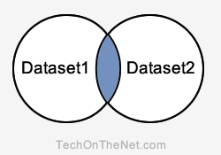

# SQL : INTERSECT 연산자

이 SQL 튜토리얼에서는 구문과 예제를 통해 SQL **INTERSECT 연산자**를 사용하는 방법을 설명합니다.

## 설명
SQL INTERSECT 연산자는 2개 이상의 SELECT 문의 결과를 반환하는 데 사용됩니다. 그러나 모든 쿼리 또는 데이터셋에서 선택한 행만 반환합니다. 레코드가 한 쿼리에는 존재하지만 다른 쿼리에는 존재하지 않는 경우 해당 레코드는 INTERSECT 결과에서 생략됩니다.

### 교집합(Intersect Query)



**설명** : INTERSECT 쿼리는 파란색 영역에 있는 레코드를 반환합니다. 이 레코드는 Dataset1과 Dataset2 모두에 존재하는 레코드입니다.

SQL INTERSECT 내의 각 SQL 문은 결과 집합에 유사한 데이터 유형을 가진 동일한 수의 필드를 가져야 합니다.

## 구문
SQL에서 INTERSECT 연산자의 구문은 다음과 같습니다:
```SQL
SELECT expression1, expression2, ... expression_n
FROM tables
[WHERE conditions]
INTERSECT
SELECT expression1, expression2, ... expression_n
FROM tables
[WHERE conditions];
```
### 매개변수 및 인수
#### **expression1, expression2, expression_n**
- 검색하려는 열 또는 계산입니다.
#### **tables**
- 레코드를 검색하려는 테이블입니다. FROM 절에 테이블이 하나 이상 나열되어야 합니다.
#### **WHERE conditions(WHERE 조건)**
- 선택 사항입니다. 레코드를 선택하려면 반드시 충족해야 하는 조건입니다.

## 참고
- 두 SELECT 문에는 동일한 수의 표현식이 있어야 합니다.
- 해당 표현식은 SELECT 문에서 동일한 데이터 유형을 가져야 합니다.  
예시 : expression1은 첫 번째 및 두 번째 SELECT 문 모두에서 동일한 데이터 유형이어야 합니다.

---
## 예제 - 단일 표현식 사용
다음은 데이터 유형이 동일한 필드가 하나 있는 SQL INTERSECT 연산자 예제입니다.
```SQL
SELECT supplier_id
FROM suppliers
INTERSECT
SELECT supplier_id
FROM orders;
```
이 SQL INTERSECT 예제에서 suppliers 및 orders 테이블에 모두 supplier_id가 나타나면 결과 집합에 나타납니다.

이제 INTERSECT 쿼리에 [WHERE 조건](WHERE.md)을 추가하여 예제를 더 복잡하게 만들어 보겠습니다.
```SQL
SELECT supplier_id
FROM suppliers
WHERE supplier_id > 78
INTERSECT
SELECT supplier_id
FROM orders
WHERE quantity <> 0;
```
이 예제에서는 각 데이터셋에 WHERE 절을 추가했습니다. 첫 번째 데이터셋은 suppliers 테이블에서 supplier_id가 78보다 큰 레코드만 반환되도록 필터링되었습니다. 두 번째 데이터셋은 수량이 0이 아닌 orders 테이블의 레코드만 반환되도록 필터링되었습니다.

---
## 예제 - 여러 표현식 사용
다음으로 SQL에서 INTERSECT 연산자를 사용하여 둘 이상의 열을 반환하는 방법의 예를 살펴보겠습니다.
```SQL
SELECT contact_id, last_name, first_name
FROM contacts
WHERE last_name <> 'Anderson'
INTERSECT
SELECT customer_id, last_name, first_name
FROM customers
WHERE customer_id < 50;
```
이 INTERSECT 예제에서 쿼리는 contacts 테이블의 contact_id, last_name 및 first_name 값이 customers 테이블의 customer_id, last_name 및 first_name 값과 일치하는 contacts 테이블의 레코드를 반환합니다.

각 데이터셋에는 마지막 이름이 Anderson이 아닌 연락처의 레코드만 반환되도록 결과를 추가로 필터링하는 WHERE 조건이 있습니다. customers 테이블의 레코드는 customer_id가 50보다 작은 경우 반환됩니다.

---
## 예제 - ORDER BY 사용
다음은 [ORDER BY 절](ORDER_BY.md)을 사용하는 INTERSECT 예제입니다.
```SQL
SELECT supplier_id, supplier_name
FROM suppliers
WHERE supplier_id > 2000
INTERSECT
SELECT company_id, company_name
FROM companies
WHERE company_id > 1000
ORDER BY 2;
```
두 SELECT 문 간에 열 이름이 다르므로 결과 집합에서 열의 위치에 따라 ORDER BY 절에서 열을 참조하는 것이 더 유리합니다. 이 예제에서는 **ORDER BY 2**로 표시된 대로 supplier_name / company_name별로 결과를 오름차순으로 정렬했습니다.

supplier_name / company_name 필드는 결과 집합에서 2번 위치에 있습니다.

---
**[< 이전](UNION_ALL.md) / [다음 : MINUS >](MINUS.md)**