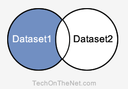

# SQL : MINUS 연산자

이 SQL 튜토리얼에서는 구문과 예제를 통해 SQL **MINUS 연산자**를 사용하는 방법을 설명합니다.

## 설명
SQL MINUS 연산자는 첫 번째 SELECT 문에서 두 번째 SELECT 문에서 반환되지 않는 모든 행을 반환하는 데 사용됩니다. 각 SELECT 문은 데이터셋을 정의합니다. MINUS 연산자는 첫 번째 데이터셋에서 모든 레코드를 검색한 다음 두 번째 데이터셋의 모든 레코드를 결과에서 제거합니다.

### 차집합(Minus Query)



**설명** : MINUS 쿼리는 파란색 영역에 있는 레코드를 반환합니다. 이는 Dataset1에 존재하지만 Dataset2에는 없는 레코드입니다.

MINUS 쿼리 내의 각 SELECT 문은 결과 집합에 유사한 데이터 유형을 가진 동일한 수의 필드가 있어야 합니다.
>팁: MINUS 연산자는 모든 SQL 데이터베이스에서 지원되는 것은 아닙니다. 오라클과 같은 데이터베이스에서 사용할 수 있습니다.
>
>SQL Server, PostgreSQL 및 SQLite와 같은 데이터베이스의 경우 이 유형의 쿼리를 수행하려면 [EXCEPT 연산자](EXCEPT.md)를 사용하십시오.

## 구문
SQL에서 MINUS 연산자의 구문은 다음과 같습니다.
```SQL
SELECT expression1, expression2, ... expression_n
FROM tables
[WHERE conditions]
MINUS
SELECT expression1, expression2, ... expression_n
FROM tables
[WHERE conditions];
```
### 매개변수 및 인수
#### **expression1, expression2, expression_n**
- 검색하려는 열 또는 계산입니다.
#### **tables**
- 레코드를 검색하려는 테이블입니다. FROM 절에 테이블이 하나 이상 나열되어야 합니다.
#### **WHERE conditions(WHERE 조건)**
- 선택 사항입니다. 레코드를 선택하려면 반드시 충족해야 하는 조건입니다.

## 참고
- 두 SELECT 문에는 동일한 수의 표현식이 있어야 합니다.
- 해당 표현식은 SELECT 문에서 동일한 데이터 유형을 가져야 합니다.  
예시: expression1은 첫 번째 및 두 번째 SELECT 문 모두에서 동일한 데이터 유형이어야 합니다.

---
## 예시 - 단일 표현식 사용
다음은 데이터 유형이 동일한 필드가 하나 있는 SQL MINUS 연산자 예제입니다.
```SQL
SELECT supplier_id
FROM suppliers
MINUS
SELECT supplier_id
FROM orders;
```
이 SQL MINUS 예제는 suppliers 테이블에는 있지만 orders 테이블에는 없는 모든 supplier_id 값을 반환합니다. 즉, suppliers 테이블에 있고 orders 테이블에도 있는 supplier_id 값이 있는 경우 이 결과 집합에는 supplier_id 값이 나타나지 않습니다.

---
## 예시 - ORDER BY 절 사용
다음은 [ORDER BY 절](ORDER_BY.md)을 사용하는 MINUS 연산자 예제입니다.
```SQL
SELECT supplier_id, supplier_name
FROM suppliers
WHERE supplier_id > 2000
MINUS
SELECT company_id, company_name
FROM companies
WHERE company_id > 1000
ORDER BY 2;
```
이 SQL MINUS 연산자 예제에서는 두 SELECT 문 간에 열 이름이 다르기 때문에 결과 집합에서 열의 위치에 따라 ORDER BY 절에서 열을 참조하는 것이 더 유리합니다. 이 예제에서는 **ORDER BY 2**로 표시된 대로 supplier_name / company_name별로 결과를 오름차순으로 정렬했습니다.

supplier_name / company_name 필드는 결과 집합에서 2번 위치에 있습니다.

---
**[< 이전](INTERSECT.md) / [다음 : EXCEPT >](EXCEPT.md)**